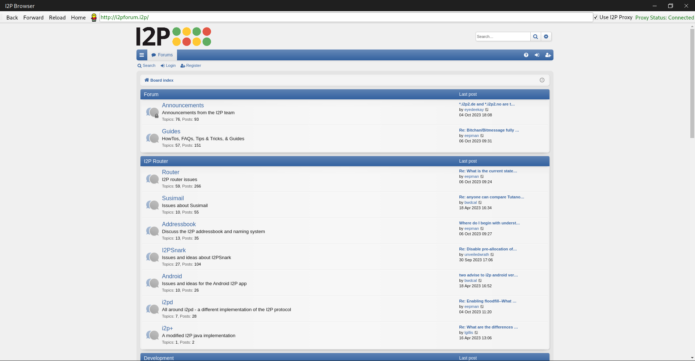
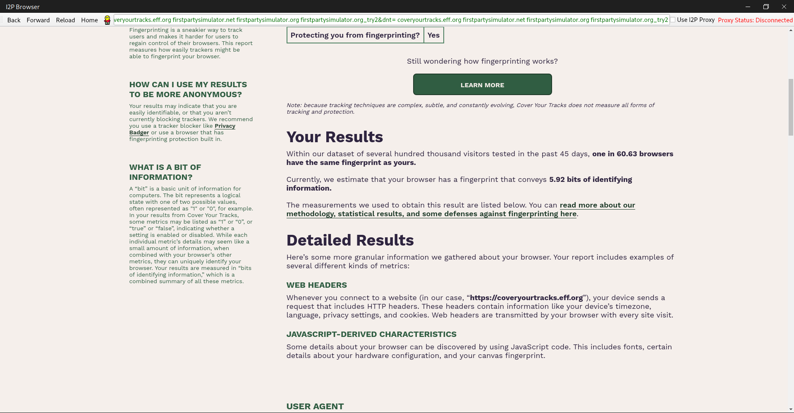
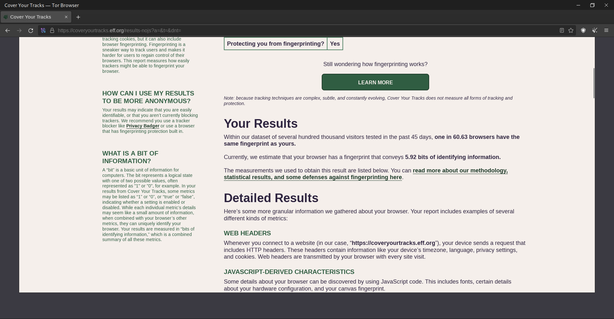

# I2P Browser
## A web browser for accessing I2P network anonymously and securely
## Description:
I2P, which stands for "Invisible Internet Project," is an anonymous network layer that allows for secure and private communication over the internet. It is designed to provide strong anonymity and privacy protections for its users. I2P browser is a web browser that is configured to work with the I2P network, allowing users to access websites and services hosted within the I2P network while maintaining a high level of anonymity.

## Features:

- Javascript is blocked by default
- Non-unique fingerprint (Each user looks identical to websites)
- Same security of Tor Browser's [safest level](https://tb-manual.torproject.org/security-settings/) by default
- Built in Python
- No browsing history and cache
- I2P Proxy Killswitch (prevents data leaks)

## Installation:

    $ git clone https://github.com/Nemesis0U/I2P-Browser.git
    $ cd I2P-Browser/
    $ sudo apt-get install python3-pyqt5.qtwebengine
    $ pip3 install -r requirements.txt
    $ python3 Browser.py

## Usage:
Step 1: Start I2P router in the background

Step 2:

    $ python3 Browser.py

## Requirements:

- I2P Router ---> https://geti2p.net/en/download

- Python >=3.9

### Screenshots:

### I2P Browser vs. Tor Browser Fingerprinting Results:

Below are the results of our privacy comparison between I2P browser and Tor browser:

*Image 1: Results from the I2P browser.*

*Image 2: Results from the Tor browser.*

### Disclaimer:

The creator of this project, disclaims no affiliation with the Invisible Internet Project (I2P) or any other third-party organizations, products, or services.